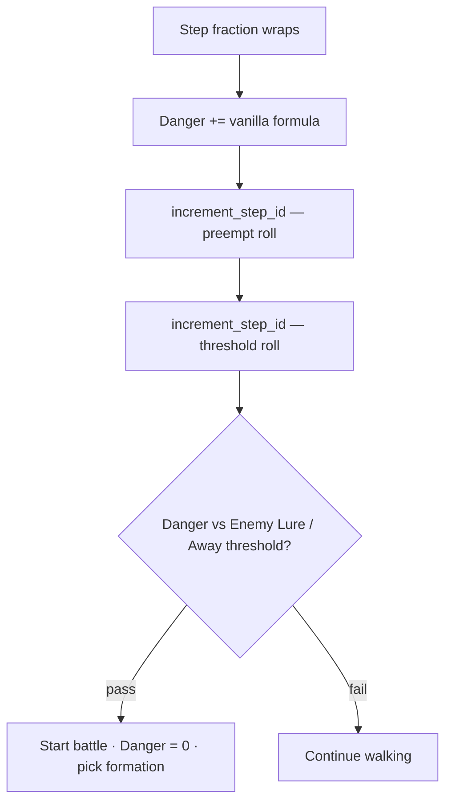
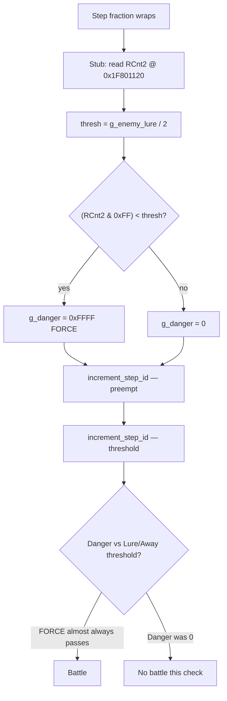

# Remaking field encounters

This mod changes how field encounters trigger on NTSC-U Final Fantasy VII. Per-map battle tables can stay vanilla; the change is in the field engine’s Danger accumulation inside `FIELD.BIN`. Preempt routing and Enemy Lure / Away still apply.

## Vanilla path (unchanged structure)

On a hostile field, roughly every eight movement frames the engine adds 32 to **step fraction**. On wrap, `encounter_check` runs:



1. **Danger** increases from field scale, walk/run, and map encounter rate (lower map rate → more battles).
2. **`increment_step_id`** runs twice — preempt roll, then danger-threshold roll.
3. If Danger clears the Enemy Lure / Away threshold, a battle starts, Danger resets, and **formation** picks the enemy set.

`increment_step_id`: StepID += 1; on wrap, Offset += 13; return `RNG_TABLE[stepid] - offset` (byte math). Formation uses the same 256-byte table with its own counter.

| Name | Address | Role |
|------|---------|------|
| Danger | `0x8007173C` | 16-bit battle accumulator |
| Formation | `0x80071C20` | enemy set index |
| StepID / Offset | `0x8009C540` / `0x8009AD2C` | encounter RNG state |
| Step fraction | `0x8009C6D8` | triggers a check on wrap |
| Enemy Lure / Away | `0x80062F19` | shared density byte (`(Danger * value) >> 12`); Lure raises it, Away lowers it |

## Locating the code

`FIELD.BIN` on disc is GZIPPS-compressed; search the decompressed image. US disc 1 ≈ **85435 → 264008** bytes. Module load base: **`0x800A0000`**. RNG table at file `0x40638` → VA **`0x800E0638`**.

| Symbol | VA |
|--------|-----|
| `increment_step_id` | `0x800AB9C8` |
| `increment_formation` | `0x800ABA34` |
| `encounter_check` | `0x800ABA70` |

Danger accumulation is **`0x800ABB7C`–`0x800ABBD0`** (88 bytes), then `jal increment_step_id` at **`0x800ABBD4`**. The stub replaces that window in place and must not overwrite the `jal`. `0x800E0700` is RNG table data, not free space.

`0x80062F19` (`g_enemy_lure`) is read in FIELD; other modules write it for both Enemy Lure and Enemy Away.

## Modded path (shipped stub)

Only the **Danger +=** block is replaced. Dual `increment_step_id` and the Lure/Away threshold compare stay vanilla.



### Shipped formula

```
entropy = *(u32*)0x1F801120          # PSX root counter RCnt2
thresh  = g_enemy_lure / 2           # integer divide
g_danger = ((entropy & 0xff) < thresh) ? 0xFFFF : 0
```

Per encounter check (assuming a uniform low byte), **P(FORCE) ≈ thresh / 256 = g_enemy_lure / 512**.

### Rate history (default lure ≈ 16)

| Revision | Threshold | P(FORCE) per check | vs raw lure/256 |
|----------|-----------|--------------------|-----------------|
| Raw lure | `lure` | ~6.25% | 100% |
| First cut | `(lure * 3) / 4` | ~4.69% | **75%** of raw |
| **Shipped** | `lure / 2` | **~3.13%** | **50%** of raw |

At default lure 16: thresh 8 → about **3.1%** of checks FORCE Danger high. Enemy Lure / Away still move `g_enemy_lure`, so materia still scales density. RAM pokes: `1` ≈ none, `16` ≈ current normal, `64` ≈ high.

Preempt / StepID routing is unchanged (Offset still advances on wrap; preempt flag `0x800716D0` still moves 4↔0).

### Rejected: COP0 Count

An early version used `mfc0` Count. On PS1 R3000A, COP0 r9 is **BDAM**, usually 0, so every check FORCEd Danger to `0xFFFF`.

Stub file offset in decompressed `FIELD.BIN`: **`0xBB7C`**.

## Disc packaging

Prefer `scripts/build_encounter_on_base.py` (per builder base). Manual path: extract `FIELD/FIELD.BIN`, decompress, apply stub, recompress, reimport, diff. See [Publishing Final Fantasy VII PlayStation mods](./publishing-psx-mods.html) and `builder/WINDOWS-INSTRUCTIONS.md`.

## Unchanged

- Per-map battle IDs / weights (unless a separate Makou edit)
- `WORLD.BIN` encounters
- Field script RNG (separate from encounter RNG)
- Preempt logic itself (StepID calls still run)
